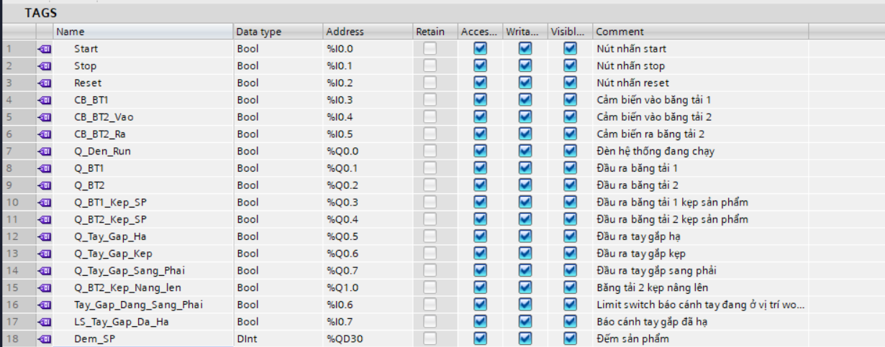
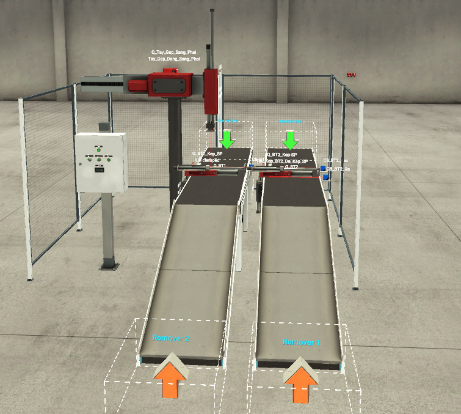
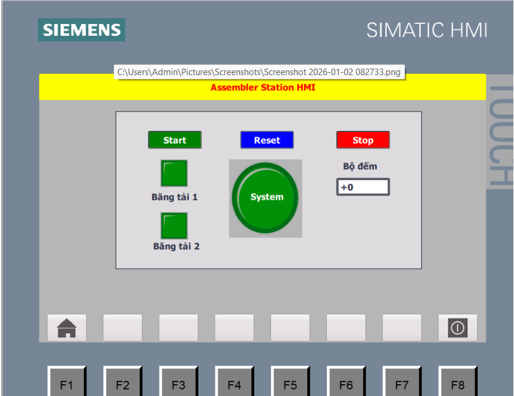
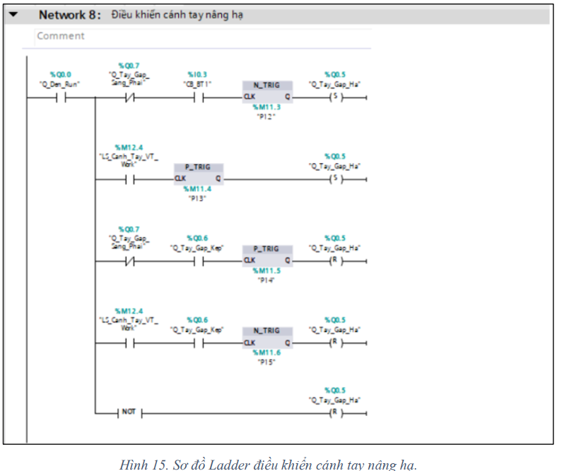
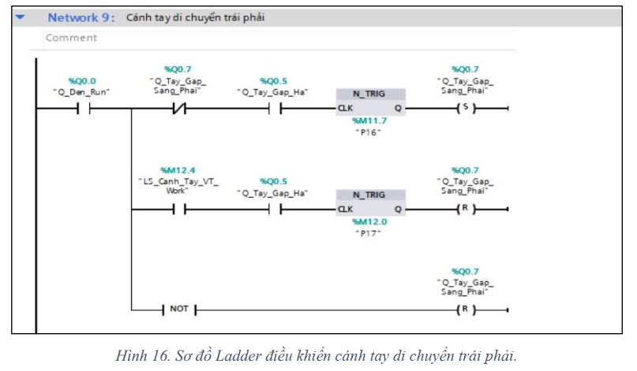
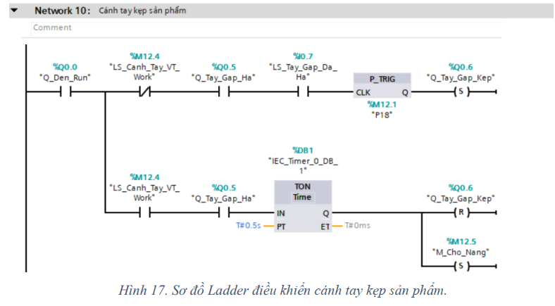

# Factory I/O Assembler Station

## Overview

This project implements an automated assembly station using Siemens TIA Portal and Factory I/O.

The system automatically assembles products through the coordination of conveyors, pneumatic clamps, sensors, and a pick-and-place arm. An HMI interface was developed for monitoring system status and controlling production operations.

This project was completed as part of the "Automation Devices and Systems" course at Ho Chi Minh City University of Technology.

---

## System Architecture

```text
Conveyor 1
    ↓
Detect Product
    ↓
Clamp Product
    ↓
Pick Product
    ↓
Move Arm
    ↓
Place Product
    ↓
Release Product
    ↓
Conveyor 2
    ↓
Finished Product Counter
```

---

## Features

- Automated assembly sequence
- Conveyor control
- Pneumatic clamp control
- Pick-and-place arm operation
- Product detection using sensors
- Product counting
- Start / Stop / Reset control
- HMI monitoring interface

---

## Hardware & Software

### PLC Platform

- Siemens S7-1200
- TIA Portal V18
- WinCC HMI
- Factory I/O

### Programming Language

- Ladder Logic (LAD)

### Simulation Environment

- Factory I/O Assembler Station
---

## Control Logic

The PLC program was divided into independent functional modules:

- Conveyor 1 control
- Conveyor 2 control
- Clamp control
- Vertical arm movement
- Horizontal arm movement
- Gripper control
- Product counting
- HMI communication

The system uses interlock logic to ensure safe operation and prevent incorrect assembly sequences.

---
## My Contributions

My primary responsibility in this team project was the development of the complete PLC control program in TIA Portal.

Tasks performed:

- Developed the entire Ladder Logic program.
- Implemented conveyor control sequences.
- Developed pneumatic clamp control logic.
- Programmed pick-and-place arm movement logic.
- Configured PLC tags and I/O mapping.
- Implemented product counting functions.
- Integrated PLC logic with Factory I/O simulation.
- Tested and debugged system operation.

---
## HMI Functions

The HMI interface provides:

- Start button
- Stop button
- Reset counter button
- System status indicator
- Conveyor status indicators
- Product counter display

---

## Project Images
## I/O Mapping



### Factory I/O Overview



### HMI Interface



### Ladder Logic




---

## Project Report

Detailed project documentation is available in:

[Project Report](Reports/BTL_TB_HTTD_L03_N3.pdf)

---

## Demonstration Video

Video demonstration:

https://youtu.be/kfNNRx-X9fA

---

## Future Improvements

Several improvements were identified during project evaluation:

- Replace timer-based positioning with limit sensors.
- Add Manual Mode for maintenance and troubleshooting.
- Upgrade pneumatic actuators to servo-based motion control.
- Implement fault detection and alarm handling.
